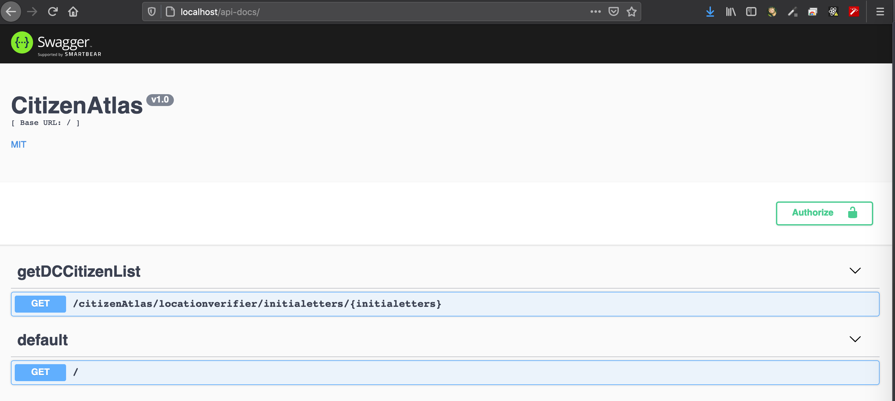
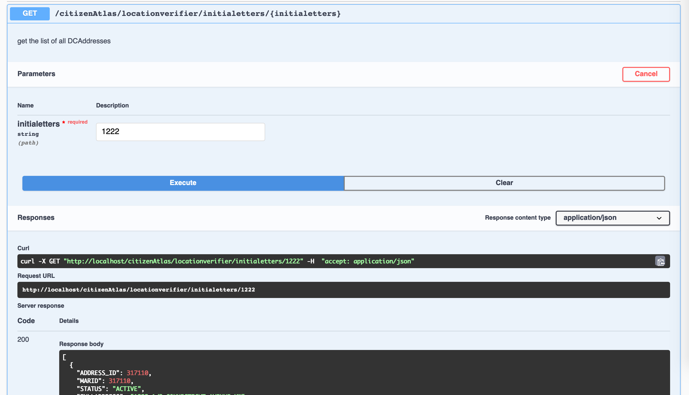

# getDCAddress

### Steps to Execute
---
* pull the repo in the local machine

`git clone <repoPath>`
* run following commands to execute

 `npm install`
* finally run nodemon

`npm run start`

</br>
</br></br>

## EndPoints:
---
``` HTTP
GET /citizenAtlas/locationverifier/initialetters/:initials HTTP/1.2
GET / HTTP/1.2
```

</br>

---
### swagger-ui 
---
</br>
List of API's </br>


</br></br>
API response </br>


